<div align="center">

<br>

# 🤘 rodbot

### **Ride or Die.** Your AI that never forgets, never repeats mistakes, and always has your back.

<br>

[](https://pypi.org/project/rodbot-ai/)
[](https://pepy.tech/project/rodbot-ai)


[](https://discord.gg/MnCvHqpUGB)

**~4,100 lines of core code.** Memory that persists. Experience that compounds. Intelligence that evolves.

[Quick Start](#quick-start) · [Why rodbot?](#why-rodbot) · [Architecture](#architecture) · [Platforms](#9-chat-platforms)

</div>

<br>

## The Name

**rod** = **R**ide **o**r **D**ie.

The kind of partner that remembers what you care about, learns what works for you, and never makes the same mistake twice. Not a chatbot you talk at — an agent that grows with you.

<p align="center"></p>

## Why rodbot?

Most AI assistants have amnesia. Every session starts from zero. They repeat the same mistakes, forget your preferences, and never get better at their job.

rodbot is different. It **remembers**, **reflects**, and **evolves**.

### 🧠 Memory That Persists

LanceDB-powered persistent memory with **vector search + keyword fallback** — works with or without embedding models.

Your agent remembers your preferences, your projects, your patterns. It automatically consolidates old context, keeps what matters, and actively forgets stale knowledge. Across sessions. Across restarts.

### 📚 Experience That Compounds (ExperienceLoop)

Inspired by Microsoft [RE-TRAC](https://arxiv.org/abs/2602.02486), rodbot runs a **closed-loop experience engine**:

- After every task → auto-extracts lessons, strategies, and failure patterns
- Before similar tasks → retrieves and injects relevant experience into the prompt
- **Confidence calibration** — tracks success rates, auto-adjusts quality scores
- **Conflict detection** — flags contradicting experiences
- **Negative learning** — past failures become warnings, not repeated mistakes
- **Active forgetting** — stale experiences are cleaned up automatically

Other agents repeat mistakes. **rodbot learns from them.**

### 🔄 Thinking + Self-Correction

- **Thinking Protocol** — deep reasoning in System Prompt. Zero extra API calls, dramatically better answers
- **Retry/Reflection** — auto-detects tool errors, escalates to deep reflection after 3 consecutive failures
- **Tool Strategy** — dynamically enables/disables tool hints based on availability, preventing hallucinated calls

### ⚡ Lightweight by Design

**~4,100 lines of core code.** Run `bash core_agent_lines.sh` to verify.

Fast startup. Low footprint. Easy to read, modify, and extend. Built on [nanobot](https://github.com/HKUDS/nanobot) — fully compatible with all upstream features.

## How rodbot Compares

rodbot sits in the sweet spot: **OpenClaw's ambition, nanobot's simplicity, and intelligence neither has.**

| | OpenClaw | nanobot | **rodbot** |
|---|---|---|---|
| Language | TypeScript | Python | **Python** |
| Core code | 430,000+ lines | ~3,800 lines | **~4,100 lines** |
| Memory | Session-only | File-based | **LanceDB (vector + keyword)** |
| Experience learning | ❌ | ❌ | **ExperienceLoop** |
| Self-reflection | ❌ | ❌ | **Thinking Protocol + Retry** |
| Open issues | 8,400+ | — | **Stable** |
| Setup | Complex wizard | 2 min | **2 min** |
| Identity crisis | 3 renames | — | **Ride or Die. Always.** |

> OpenClaw is a powerhouse with a massive community — but 430K lines of TypeScript means a deep dependency tree, complex debugging, and [8,400+ open issues](https://github.com/openclaw/openclaw/issues). nanobot proved you only need ~4,000 lines. **rodbot takes that foundation and adds the brain** — memory, experience, and self-correction — in just 300 extra lines.

<p align="center"></p>

## Quick Start

```bash
pip install rodbot-ai
rodbot onboard
```

Set your API key in `~/.rodbot/config.json`:

```json
{
  "providers": {
    "openrouter": {
      "apiKey": "sk-or-v1-xxx"
    }
  }
}
```

Start your agent:

```bash
rodbot agent
```

**That's it. Working AI assistant in 2 minutes.**

Optional: add a **Utility Model** for background tasks (experience extraction, memory consolidation) to save costs:

```json
{
  "agents": {
    "defaults": {
      "model": "anthropic/claude-sonnet-4-20250514",
      "utilityModel": "openrouter/google/gemini-flash-1.5"
    }
  }
}
```

## 9 Chat Platforms

One config. One command: `rodbot gateway`.

| Platform | Setup |
|----------|-------|
| **Telegram** | Bot token from @BotFather |
| **Discord** | Bot token + Message Content intent |
| **WhatsApp** | QR code scan |
| **Feishu** | App ID + App Secret |
| **Slack** | Bot token + App-Level token |
| **Email** | IMAP/SMTP credentials |
| **QQ** | App ID + App Secret |
| **DingTalk** | App Key + App Secret |
| **Mochat** | Claw token (auto-setup) |

## 16+ LLM Providers

OpenRouter · Anthropic · OpenAI · DeepSeek · Gemini · Groq · MiniMax · SiliconFlow · VolcEngine · DashScope · Moonshot · Zhipu · AIHubMix · vLLM · OpenAI Codex · GitHub Copilot · Custom endpoint

Adding a new provider? **2 steps, ~10 lines of code.** Add a `ProviderSpec` to `registry.py`, add a field to `schema.py`. Done.

## MCP Support

Model Context Protocol — extend with any tool. Config is **compatible with Claude Desktop and Cursor**:

```json
{
  "tools": {
    "mcpServers": {
      "filesystem": {
        "command": "npx",
        "args": ["-y", "@modelcontextprotocol/server-filesystem", "/path"]
      }
    }
  }
}
```

Supports **stdio** and **HTTP** modes.

## Docker

```bash
docker compose run --rm rodbot-cli onboard
vim ~/.rodbot/config.json
docker compose up -d rodbot-gateway
```

## CLI

| Command | What it does |
|---------|-------------|
| `rodbot onboard` | Initialize |
| `rodbot agent` | Interactive chat |
| `rodbot agent -m "..."` | Single message |
| `rodbot gateway` | Start all channels |
| `rodbot status` | Show status |
| `rodbot cron list` | Scheduled tasks |

## Project Structure

```
rodbot/
├── agent/          # Core agent logic
│   ├── loop.py     # Agent loop (Thinking + Retry + Experience)
│   ├── context.py  # Prompt builder + experience injection
│   ├── memory.py   # LanceDB persistent memory
│   ├── subagent.py # Background task execution
│   └── tools/      # Built-in tools (Shell, File, Web, MCP)
├── skills/         # GitHub, Weather, Cron, Tmux
├── channels/       # 9 chat platform integrations
├── providers/      # 16+ LLM provider adapters
├── bus/            # Async message routing
├── cron/           # Scheduled tasks
└── cli/            # Commands
```

## Contributing

PRs welcome. The codebase is intentionally small and readable.

- [ ] Multi-modal — images, voice, video
- [x] ~~Long-term memory~~ — LanceDB
- [x] ~~Better reasoning~~ — Thinking Protocol + Retry/Reflection
- [x] ~~Self-improvement~~ — ExperienceLoop
- [ ] More integrations — Calendar, etc.

<details>
<summary><b>中文文档</b></summary>

<br>

### 什么是 rodbot

**rod** = **R**ide **o**r **D**ie — 生死之交。

rodbot 基于 [nanobot](https://github.com/HKUDS/nanobot) 打造，核心代码仅 ~4,100 行，在保持极致轻量的基础上增加了 **记忆系统**、**经验学习**、**深度思考** 和 **自动纠错**。

### 核心优势

| 特性 | 说明 |
|------|------|
| **ExperienceLoop** | 从历史任务提取经验，下次类似任务自动注入，含置信度校准、冲突检测、负面学习、主动遗忘 |
| **LanceDB 记忆** | 向量搜索 + 关键词降级，长期记忆自动整合与清理 |
| **Thinking Protocol** | System Prompt 内置深度推理，零额外延迟 |
| **Retry/Reflection** | 工具出错自动重试，连续 3 次失败升级反思策略 |

### 快速开始

```bash
pip install rodbot-ai && rodbot onboard
# 编辑 ~/.rodbot/config.json 设置 API Key
rodbot agent
```

详细配置请参考英文文档。

</details>

<div align="center">

<br>

### Star History

<a href="https://star-history.com/#Suge8/rodbot&Date">
  <picture>
    <source media="(prefers-color-scheme: dark)" srcset="https://api.star-history.com/svg?repos=Suge8/rodbot&type=Date&theme=dark" />
    <source media="(prefers-color-scheme: light)" srcset="https://api.star-history.com/svg?repos=Suge8/rodbot&type=Date" />
    
  </picture>
</a>

<br><br>

<sub>Ride or Die. 🤘</sub>

</div>
